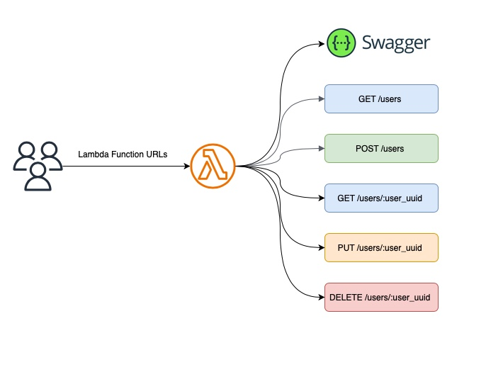
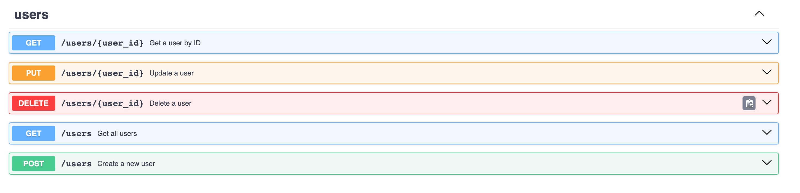

# Building a REST API with AWS Lambda URLs, Python, and AWS CDK

[](https://github.com/myarik/aws-cdk-python-demo)

This branch contains the demo code that demonstrates how to build a REST API using AWS Lambda Function URLs and AWS CDK
with Python.

## Table of Contents

- [Prerequisites](#prerequisites)
- [Service Schema](#service-schema)
- [Available Endpoints](#available-endpoints)
- [Installation](#installation)
- [Using the API](#using-the-api)
- [Swagger UI](#swagger-ui)

## Prerequisites

- Python 3.12+
- AWS CLI configured with appropriate permissions
- Node.js and npm (for AWS CDK)
- Poetry for Python dependency management

## Service Schema

The schema below outlines the project's structure



## Available Endpoints

The API provides the following endpoints:

- GET /users - Retrieves all users and supports optional query parameters for filtering.
- GET /users/:user_uuid - Retrieves a specific user by their UUID
- POST /users - Create a new user
- PUT /users/:user_uuid - Update an existing user
- DELETE /users/:user_uuid - Deletes a user by their UUID

## Installation

1. Clone the repository:

```bash
git clone --branch lambda-url git@github.com:myarik/aws_cdk_python_demo.git 
cd aws-cdk-python-demo
```

2. Install the dependencies:

```bash
make dev
```

3. Run tests using:

```bash
make test
```

4. Deploy the stack:

```bash
make deploy
```

## Using the API

To use this API, send HTTP requests to the Lambda Function URL with the appropriate HTTP method and path.

**Example:**

```shell
# Create a new user
$ http https://<url-id>.lambda-url.<region>/users email=manager4@example.com role=manager
# Retrieve a specific user
$ http https://<url-id>.lambda-url.<region>/users/550e8400-e29b-41d4-a716-446655440008
# Retrieve all users with a specific role and active status
$ http https://<url-id>.lambda-url.<region>/users\?role\=customer\&is_active\=false
# Update an existing user
$ http PUT https://<url-id>.lambda-url.<region>/users/550e8400-e29b-41d4-a716-446655440008 email=newemail@example.com role=admin active:=false
# Delete a user
$ http DELETE https://<url-id>.lambda-url.<region>/users/550e8400-e29b-41d4-a716-446655440008
````

## Swagger UI

This API includes Swagger documentation for easy exploration and testing. You can access the Swagger UI by sending a GET
request to the `/swagger` endpoint of the Lambda Function URL.

